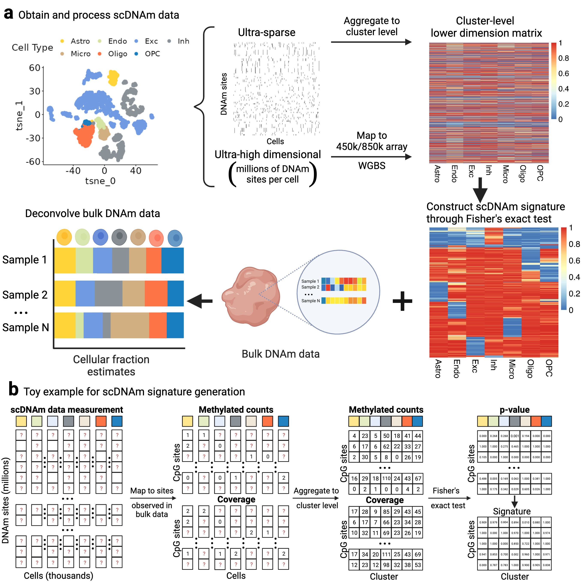

# scMD
scMD (single cell Methylation Deconvolution), a cellular deconvolution framework to reliably estimate cell type fractions from tissue-level DNAm data with single-cell DNAm references. 


## Installation
```
devtools::install_github("randel/scMD")
```

## Workflow



Tutorial
-----------------
https://randel.github.io/scMD/


## Reference
Manqi Cai, Jingtian Zhou, Chris McKennan, Jiebiao Wang.
scMD facilitates cell type deconvolution using single-cell DNA methylation references.
Communications Biology 2024. https://www.nature.com/articles/s42003-023-05690-5
